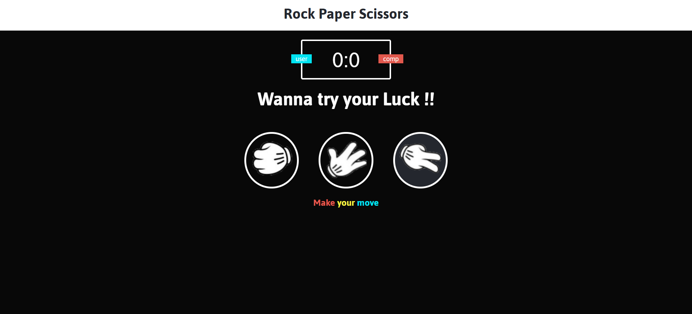
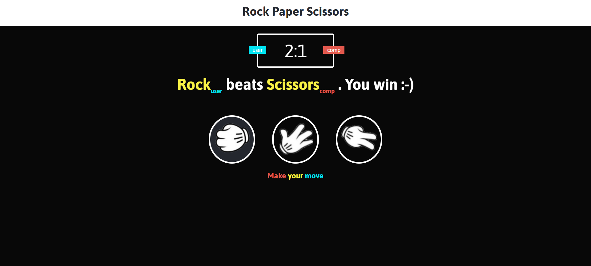

# Rock-Paper-Scissors
Rock paper scissors, a game built using basic HTML, CSS and JavaScript.

to play the game or to use it as a small project
1. clone the repo
2. run the index.html file 
3. you are ready with the game.

# A look of the front end of the game before starting

# A look of the front end of the game while playing and displaying scores

